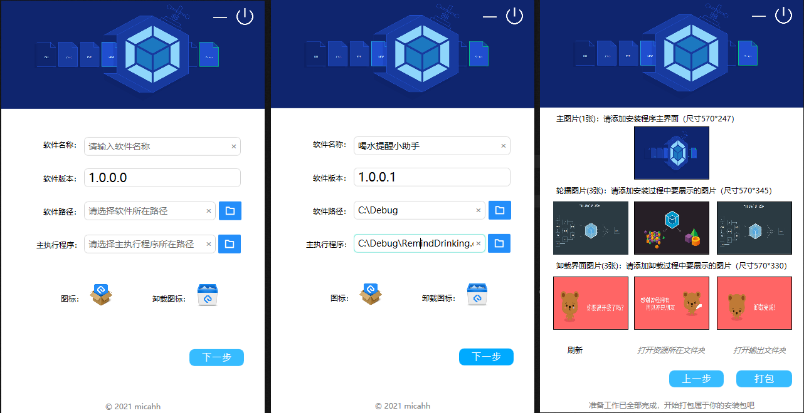
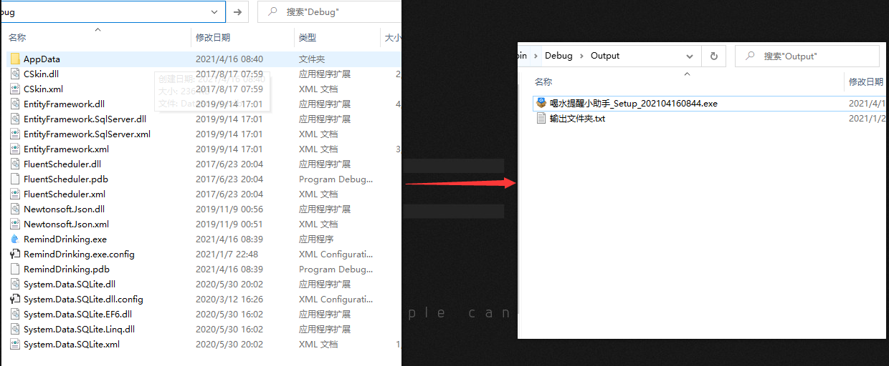
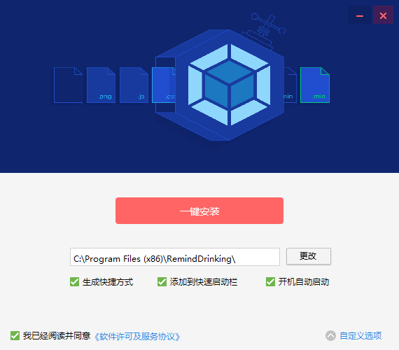
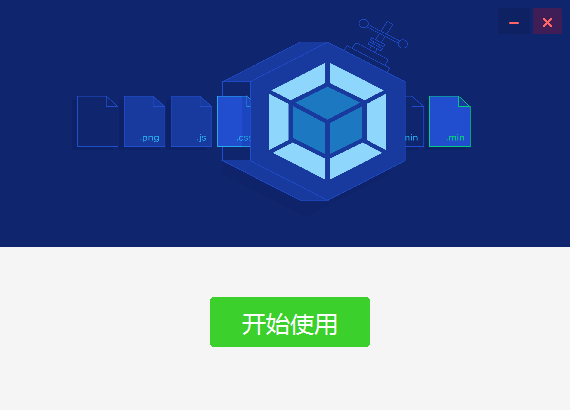

<p align="center">
  <a href="https://github.com/micahh28/HHSoftwarePack">
    
  </a>

  <h3 align="center">安装包制作工具</h3>
  <p align="center">
    一键打包、极速安装、自定义效果
    <br />
    <br />
    <a href="https://github.com/micahh28/HHSoftwarePack/blob/main/README.md">查看文档</a>
    ·
    <a href="https://github.com/micahh28/hhgiftcash/issues">报告Bug</a>
    ·
    <a href="https://github.com/micahh28/HHSoftwarePack/releases">立即下载</a>
  </p>

</p>


## 目录

- [入门指南](#入门指南)
- [程序文件目录说明](#程序文件目录说明)
- [示例](#示例)
- [版权说明](#版权说明)
- [作者](#作者)
- [捐赠](#捐赠)

### 入门指南
HHSoftwarePack 是基于NSIS方式的安装包制作工具，界面可以自由定制，拿来即用。快速为windows程序打包成setup.exe文件

下载Releases中最新安装包，即刻体验全部功能，你无需涉足各种脚本工具，只需面对你所需要打包的程序本身，让一切你所需要的精美安装界面效果，从这里信手拈来。

### 程序文件目录说明
eg:

```
HHSoftwarePack.exe
├── /Output/ //输出目录
├── /x64/    //64位所需dll
├── /x86/    //32位所需dll
├── /SoftSetupCore/  //核心打包库
├── SoftwarePack.exe //主执行程序

```

### 示例







### 版权说明

该项目签署了MIT 授权许可，详情请参阅 [LICENSE.txt](https://github.com/micahh28/HHSoftwarePack/blob/main/LICENSE)

### 作者

- [micahh28](https://github.com/micahh28) .Net开发的小学生


### 捐赠

- 请在体验后再考虑自愿捐助。倘若于你有益，欢迎小额赞赏（学生党请勿投币）。

  如需退款请将带有付款单号的截图和收款二维码发送邮件至：1067051515@qq.coom

<table>
    <tr>
        <td></td>
        <td></td>
    </tr>
</table>

